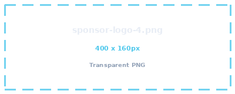

# Image guide

All the images are now real. To swap any of them later, **save the new photo with exactly the same
filename into `assets/images/`, overwriting what's there** — no HTML changes needed. The table below
says what each filename is used for.

## What goes where

| File (in `assets/images/`) | Size (px) | Where it appears | What to use |
|---|---|---|---|
| `hero-community.jpg` | 1600 × 900 | Big image under the hero headline | Wide shot of a full room at a meetup — people visible, venue readable |
| `event-sydney.jpg` | 800 × 600 | Gallery tile 1 — captioned "Sydney" | Photo from a Sydney event |
| `event-melbourne.jpg` | 800 × 600 | Gallery tile 2 — captioned "Melbourne" | Photo from a Melbourne event |
| `event-perth.jpg` | 800 × 600 | Gallery tile 3 — captioned "Perth" | Photo from a Perth event |
| `gallery-1.jpg` | 900 × 600 | Gallery tile 4 — "Full rooms, every city" | A packed room |
| `gallery-2.jpg` | 900 × 600 | Gallery tile 5 — "Speakers & demos" | Speaker or demo in progress |
| `gallery-3.jpg` | 900 × 600 | Gallery tile 6 — "Expert tech talks" | A talk in progress |
| `sponsor-logo-1.png` | 400 × 160 | Sponsor wall — AMD ✅ done | Sponsor logos, **transparent PNG**, logo centred with breathing room |
| `sponsor-logo-2.png` | 400 × 160 | Sponsor wall — Avnet ✅ done | " |
| `sponsor-logo-3.png` | 400 × 160 | Sponsor wall — element14 ✅ done | " |
| `sponsor-logo-4.png` … `-6.png` | 400 × 160 | Spare slots — files exist, not yet in the page | " |
| `og-image.jpg` | 1200 × 630 | Link preview when the site is shared on LinkedIn/Slack | Branded card: logo + "Physical AI Meetup" + one line |

All six gallery tiles are cropped to 3:2 by CSS, so keep the subject near the centre. Captions sit in a
gradient strip along the bottom of each tile — edit them in `index.html` if you reorder the photos.

The chapter cards deliberately carry no photos: there are eight of them and only some cities have
usable shots, so a mixed set would look unfinished. The gallery is where photos live.

## Adding or removing sponsor logos

The wall currently shows three: AMD, Avnet, element14. The grid is `auto-fit`, so rows reflow
on their own — you never need to touch the CSS.

To add a fourth, save its transparent PNG as `assets/images/sponsor-logo-4.png` (400 × 160, logo
centred) and add one line in `index.html` inside `<div class="sponsor-logos">`:

```html

```

Put the real company name in `alt` — screen readers and search engines read it.

**Keeping logos visually even:** the three in place were normalised to equal optical weight
(equal area, not equal width) on a shared 800 × 320 transparent canvas. A new logo dropped in raw
will look bigger or smaller than its neighbours. Easiest fix is to ask Claude to normalise it to
match, or centre it yourself on an 800 × 320 transparent canvas so it occupies roughly the same
area as the others.

## Two gotchas worth knowing

**A `.jpg` extension doesn't make a file a JPEG.** Three of the photos in the first batch were
actually AVIF files that had been renamed to `.jpg`. Most current browsers sniff the bytes and
render them anyway, but the server still announces them as JPEG, older Safari can't decode AVIF at
all, and some tools will simply show a broken image. If you export from Photos, Preview or a phone,
choose JPEG explicitly rather than renaming afterwards. To check what a file really is:

```bash
file assets/images/*.jpg      # says "JPEG image data" or "ISO Media, AVIF Image"
```

**Camera originals are far too heavy for a web page.** The first batch averaged 3–4 MB each
(one was 6867 × 4578). A visitor on mobile data would have waited a long time. They're now resized
and re-encoded — same photos, ~1 MB for the whole set. Originals are kept in
`_archive/original-photos/` (gitignored, so they stay on your Mac and never deploy).

## File size budget

The page's own code (HTML + CSS) is about **35 KB**. To keep a first visit comfortably light, aim for:

- `hero-community.jpg` — under 200 KB
- each chapter / gallery photo — under 120 KB
- each sponsor logo — under 30 KB
- `og-image.jpg` — under 150 KB

Everything below the hero is lazy-loaded, so only the hero image and the logo actually load up front.

Easy ways to compress: [Squoosh](https://squoosh.app) (drag in, export at ~75% quality), or on your Mac:

```bash
# resize + compress a photo to the right width
sips -Z 1600 photo.jpg --out assets/images/hero-community.jpg
```

If you want smaller files still, export as `.webp` instead — but then update the filename in
`index.html` to match (e.g. `hero-community.webp`).

## Favicon

Already done — generated from `assets/source/Logo no words.png` with the black background removed:

- `assets/icons/favicon.ico` (16/32/48 px, what the browser tab uses)
- `assets/icons/favicon-16x16.png`, `favicon-32x32.png`, `favicon-192x192.png`, `favicon-512x512.png`
- `assets/icons/apple-touch-icon.png` (180 px, dark background — iOS ignores transparency)
- `assets/icons/logo-mark.png` (transparent, used in the nav bar and footer)

To regenerate them after a logo change, re-run `tools/make-icons.py`.
